# Ancestral Spirits Automation Test

This automated gameplay test validates the core mechanics of the **Ancestral Spirits** ultimate ability.

The test verifies:

- Ultimate activation state
- Damage application
- Health tracking
- Increased melee damage during Ultimate
- Healing after combat
- Damage reduction during Ultimate
- Final validation state

---

# Video of the Autotest

  

---

# Full Blueprint Overview

  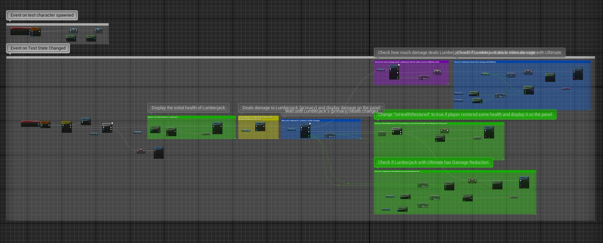

Complete overview of the automation test Blueprint graph.

---

# 1. Test Character Initialization

  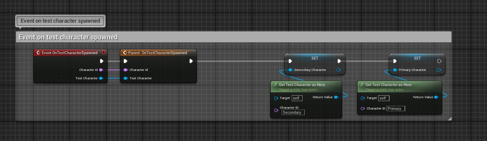

The test initializes both Primary and Secondary test characters after spawning.

### Main actions:
- Assign spawned heroes
- Store references for future checks
- Prepare the test environment

---

# 2. Ultimate State Tracking

  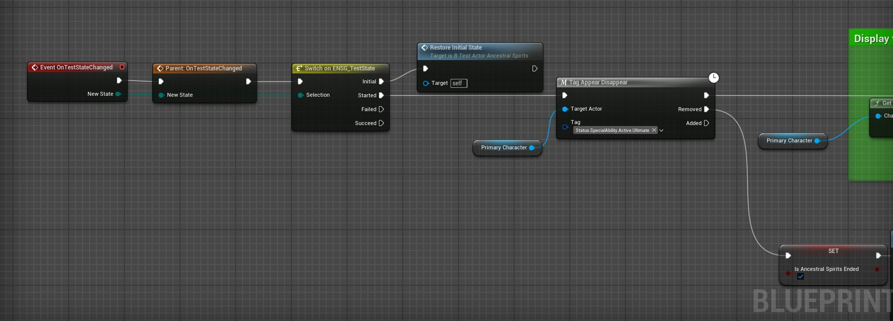

The test waits for the Ultimate gameplay tag activation and tracks when the Ancestral Spirits state ends.

### Checks:
- Ultimate activation
- Ultimate end state
- Correct gameplay tag handling

---

# 3. Initial Health Display

  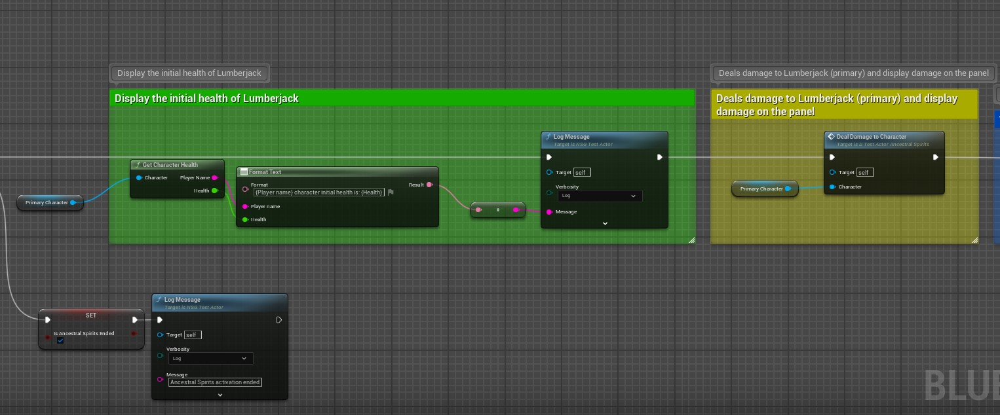

Displays the initial health value of the Lumberjack character before combat starts.

### Checks:
- Initial health retrieval
- Health logging
- Correct character reference

---

# 4. Damage Application

  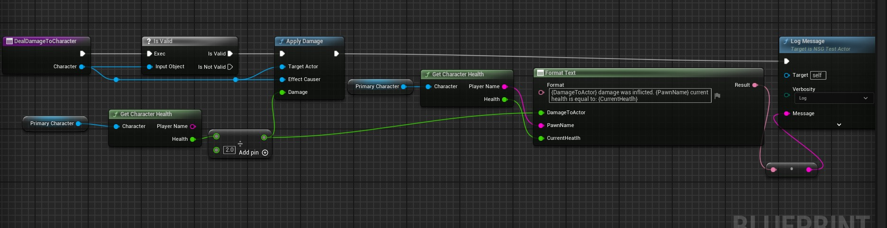

Applies damage to the character and logs updated health values.

### Checks:
- Damage application
- Health recalculation
- Correct health update after hit

---

# 5. Health Change Tracking

  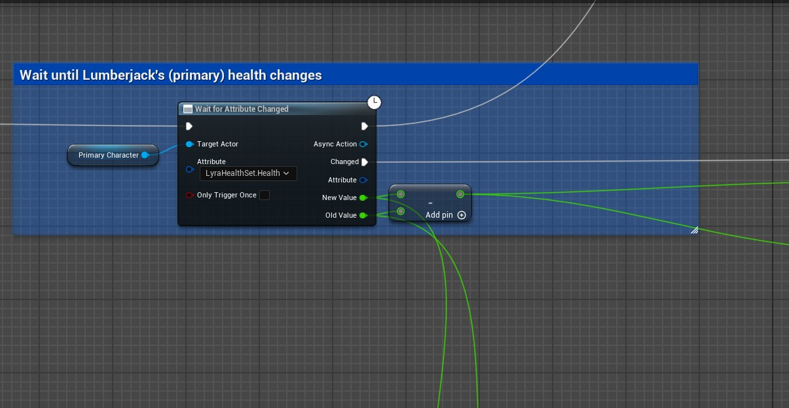

Waits until the Lumberjack's health attribute changes.

### Checks:
- Health attribute monitoring
- Damage difference calculation
- Attribute update event

---

# 6. Ultimate Damage Validation

  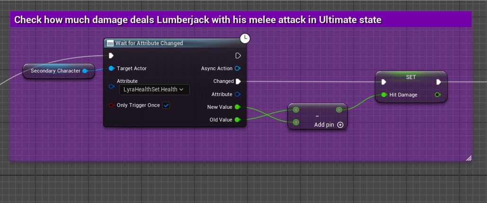

Measures damage dealt during Ultimate state and stores the hit damage value.

### Checks:
- Melee damage during Ultimate
- Damage capture
- Correct damage calculation

---

# 7. Increased Damage Verification

  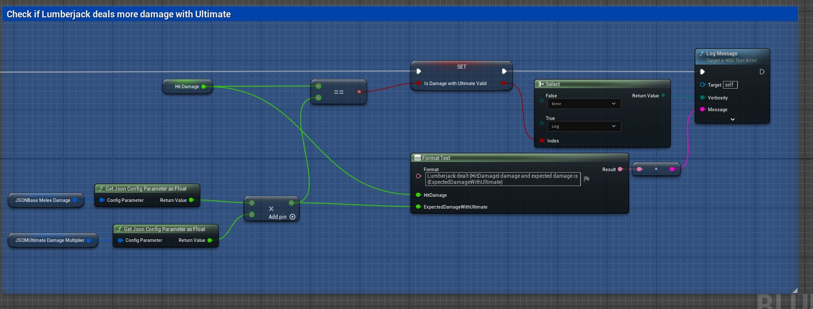

Compares actual Ultimate damage with expected values from config parameters.

### Checks:
- Base melee damage
- Ultimate damage multiplier
- Expected damage validation

---

# 8. Healing Validation

  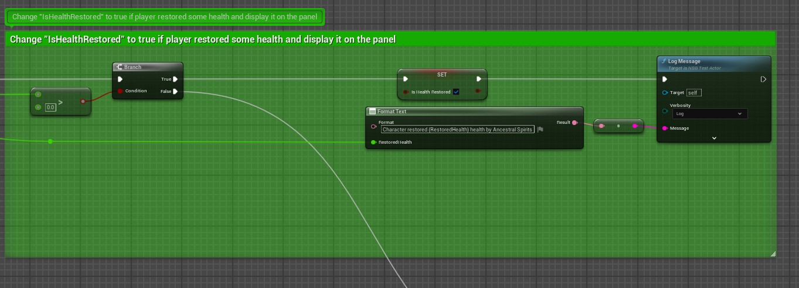

Checks if the character restored health after combat interactions.

### Checks:
- Health restoration
- Healing detection
- Boolean validation state

---

# 9. Damage Reduction Validation

  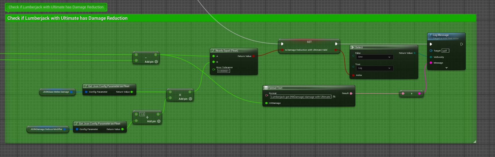

Validates that the Lumberjack receives reduced incoming damage during Ultimate.

### Checks:
- Damage reduction modifier
- Reduced damage calculation
- Float comparison validation

---

# 10. Final Test Validation

  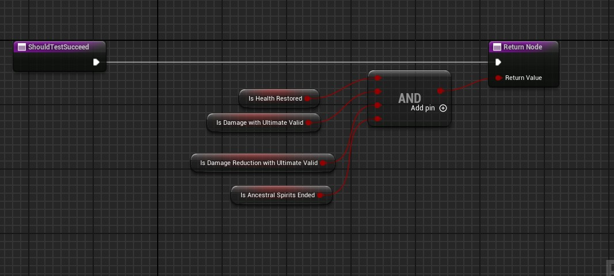

Final AND validation node combining all test states.

### The test succeeds only if:
- Healing worked correctly
- Ultimate damage is valid
- Damage reduction is valid
- Ultimate state ended correctly

---

# Skills Demonstrated

- Unreal Engine 5
- Gameplay automation testing
- Blueprint scripting
- Gameplay Ability System (GAS)
- Gameplay Tags
- Async attribute monitoring
- Runtime gameplay validation
- Event-driven gameplay testing

---

# Technologies Used

- Unreal Engine 5
- Blueprint Automation Testing
- Gameplay Ability System (GAS)
- Gameplay Tags
- Blueprint Async Tasks
- Event-driven gameplay validation

---

# Test Result

✅ Test passes only if all gameplay validation checks succeed.

---

# Author

Bogdan Yushkov  
QA Automation Engineer / Unreal Engine 5
