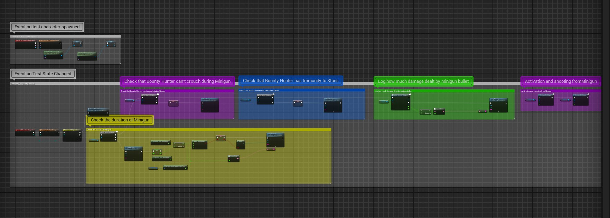
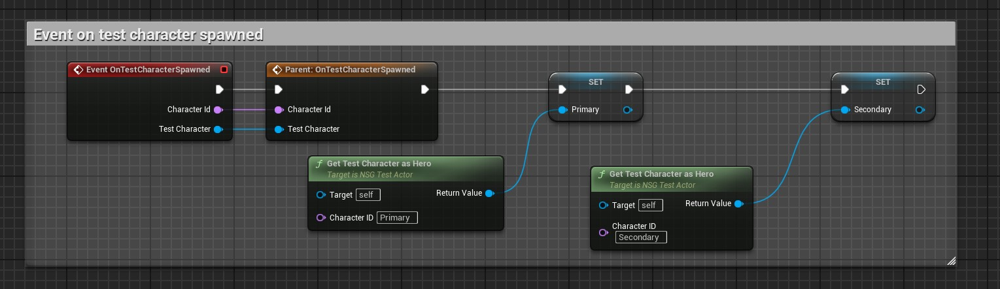
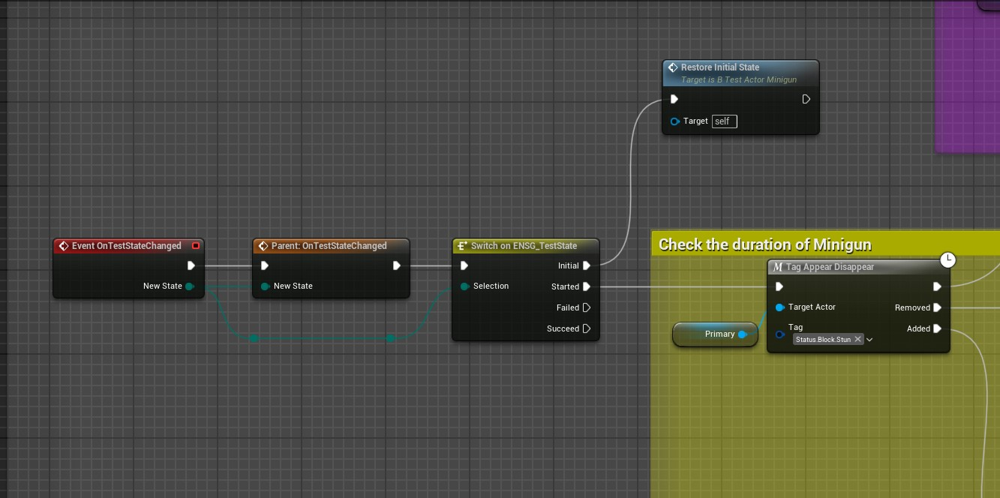
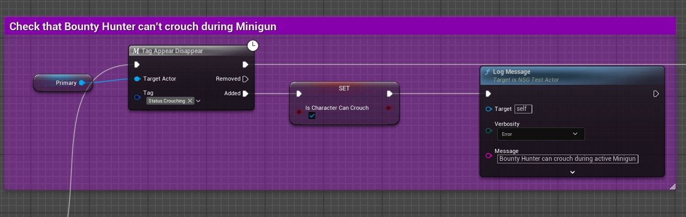
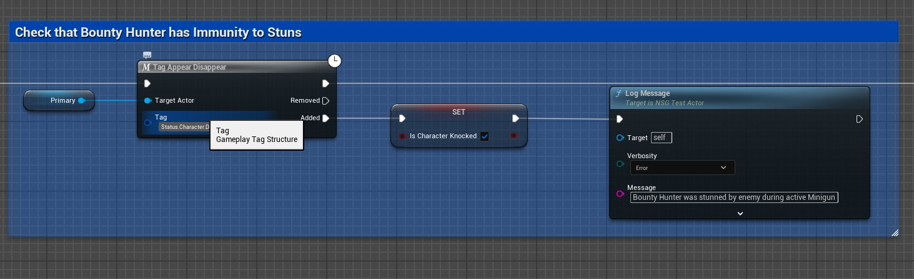
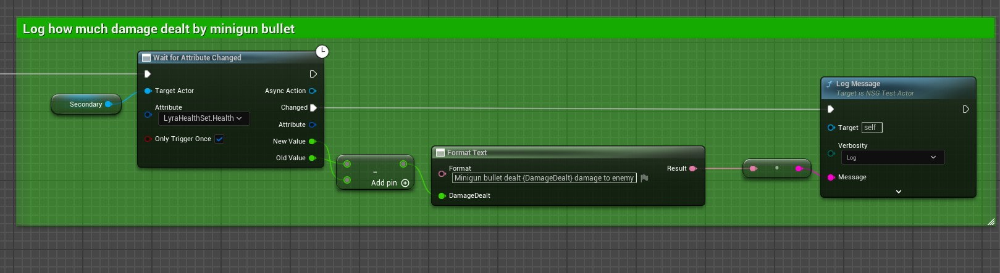
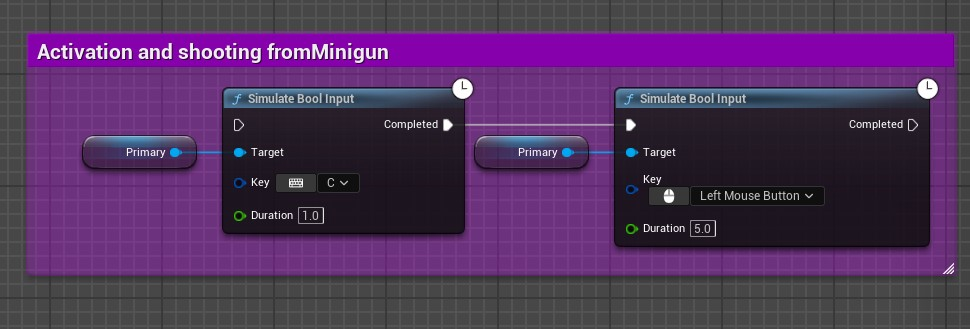
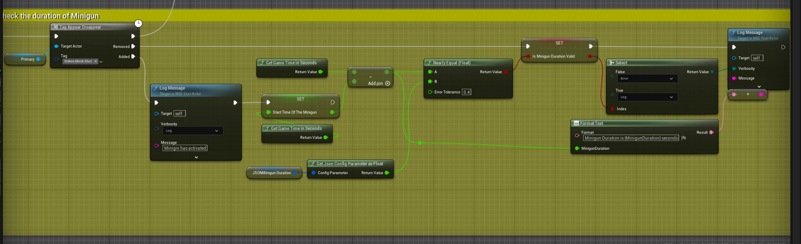

# Minigun Automation Test

This automated gameplay test validates the core mechanics of the **Minigun** ability.

The test verifies:

- Minigun activation
- Shooting simulation
- Damage application
- Minigun duration
- Stun immunity
- Crouch restriction during Minigun
- Final validation state

---

# Video of the Autotest

  

---

# Full Blueprint Overview

  

Complete overview of the automation test Blueprint graph.

---

# 1. Test Character Initialization

  

The test initializes Primary and Secondary test characters after spawning.

### Main actions:
- Assign spawned heroes
- Store references for gameplay checks
- Prepare the test environment

---

# 2. Minigun State Tracking

  

Tracks the Minigun gameplay state and restores the initial test state when required.

### Checks:
- Ability activation state
- Gameplay tag tracking
- Correct state transitions

---

# 3. Crouch Restriction Validation

  

Verifies that the Bounty Hunter cannot crouch while Minigun is active.

### Checks:
- Crouch state detection
- Gameplay restriction validation
- Error logging if crouching becomes available

---

# 4. Stun Immunity Validation

  

Checks that the character remains immune to stun effects during active Minigun.

### Checks:
- Stun gameplay tag monitoring
- Immunity validation
- Error logging on stun application

---

# 5. Damage Logging

  

Tracks health attribute changes and logs damage dealt by Minigun bullets.

### Checks:
- Damage calculation
- Attribute monitoring
- Correct damage logging

---

# 6. Ability Activation and Shooting Simulation

  

Simulates player input to activate the Minigun ability and perform continuous shooting.

### Simulated actions:
- Ability activation key press
- Mouse input simulation
- Continuous firing duration

---

# 7. Minigun Duration Validation

  

Measures Minigun active duration and compares it with expected configuration values.

### Checks:
- Ability duration timing
- Config parameter validation
- Float comparison with tolerance
- Correct Minigun lifetime

---

# Skills Demonstrated

- Unreal Engine 5
- Gameplay automation testing
- Blueprint scripting
- Gameplay Ability System (GAS)
- Gameplay Tags
- Async attribute monitoring
- Runtime gameplay validation
- Input simulation testing

---

# Technologies Used

- Unreal Engine 5
- Blueprint Automation Testing
- Gameplay Ability System (GAS)
- Gameplay Tags
- Blueprint Async Tasks
- Event-driven gameplay validation

---

# Test Result

✅ Test passes only if all gameplay validation checks succeed.

---

# Author

Bogdan Yushkov  
QA Automation Engineer / Unreal Engine 5
