# Mosh Pit Automation Test

This automated gameplay test validates the core mechanics of the **Mosh Pit** ability.

The test verifies:

- Mosh Pit activation state
- Ability duration
- Enemy ability blocking
- Weapon usage blocking
- Weapon release after Mosh Pit ends
- Ability release after Mosh Pit ends
- Enemy movement speed debuff
- Final validation state

---

# Video of the Autotest

  

---

# Full Blueprint Overview

  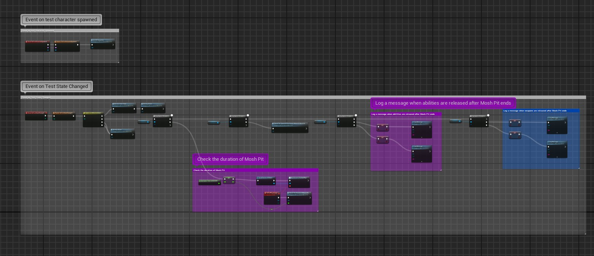

Complete overview of the automation test Blueprint graph.

---

# 1. Test Character Initialization

  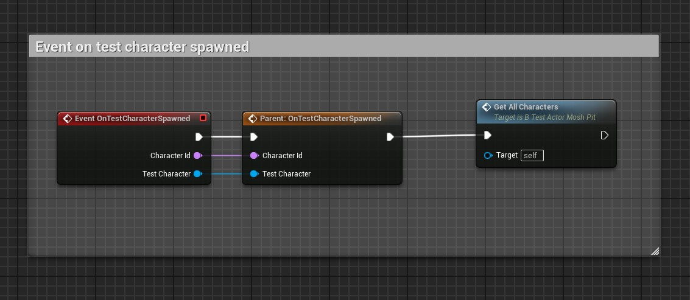

The test initializes all required test characters after spawning.

### Main actions:
- Initialize test characters
- Store gameplay references
- Prepare the test environment

---

# 2. Gameplay State Tracking

  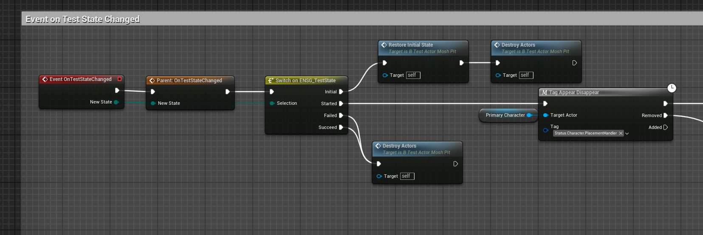

Tracks gameplay test states and restores the initial state when the test finishes.

### Checks:
- Gameplay state transitions
- Mosh Pit gameplay tag tracking
- Cleanup and actor destruction

---

# 3. Initial State Reset

  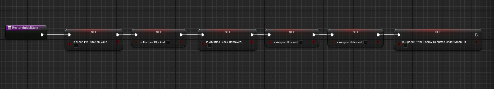

Resets all validation flags before starting the automation sequence.

### Reset values:
- Mosh Pit duration validation
- Ability block states
- Weapon block states
- Enemy movement debuff validation

---

# 4. Actor Cleanup Validation

  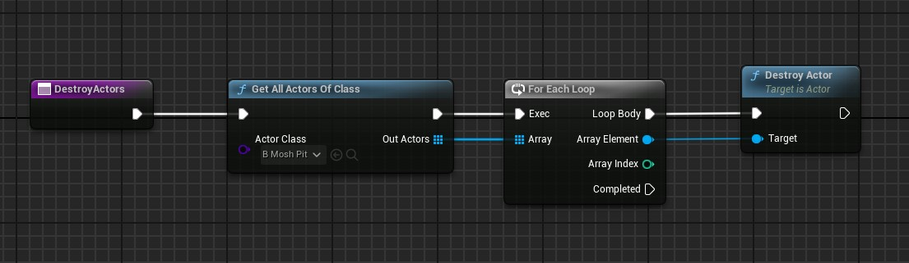

Destroys all spawned Mosh Pit actors after the test completes.

### Checks:
- Actor lookup
- Actor cleanup
- Proper object destruction

---

# 5. Mosh Pit Duration Validation

  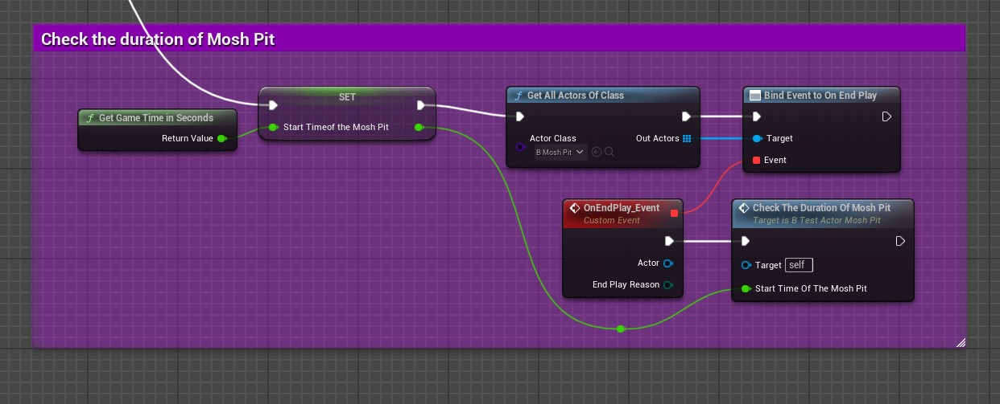

Measures the duration of the Mosh Pit ability and validates it against expected values.

### Checks:
- Ability lifetime tracking
- EndPlay event binding
- Duration comparison
- Timing validation

---

# 6. Enemy Speed Debuff Validation

  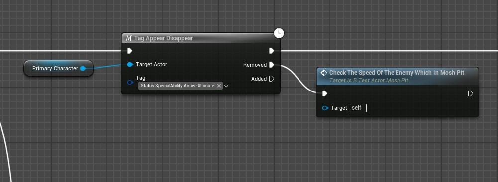

Triggers enemy movement speed validation while the enemy is inside the Mosh Pit area.

### Checks:
- Gameplay tag monitoring
- Speed debuff activation
- Runtime debuff validation

---

# 7. Movement Speed Comparison

  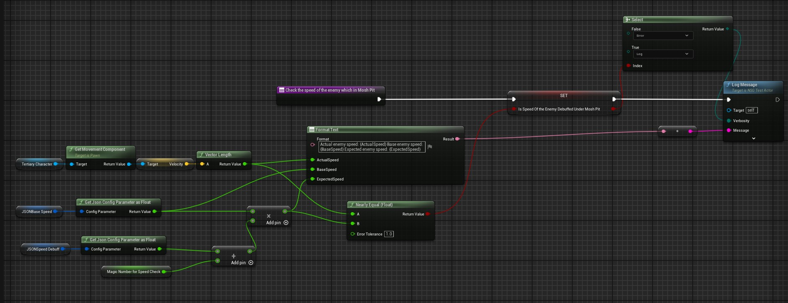

Compares actual enemy movement speed with expected debuffed values.

### Checks:
- Current velocity calculation
- Config-driven expected speed
- Float comparison validation
- Debuff correctness

---

# 8. Ability Release Validation

  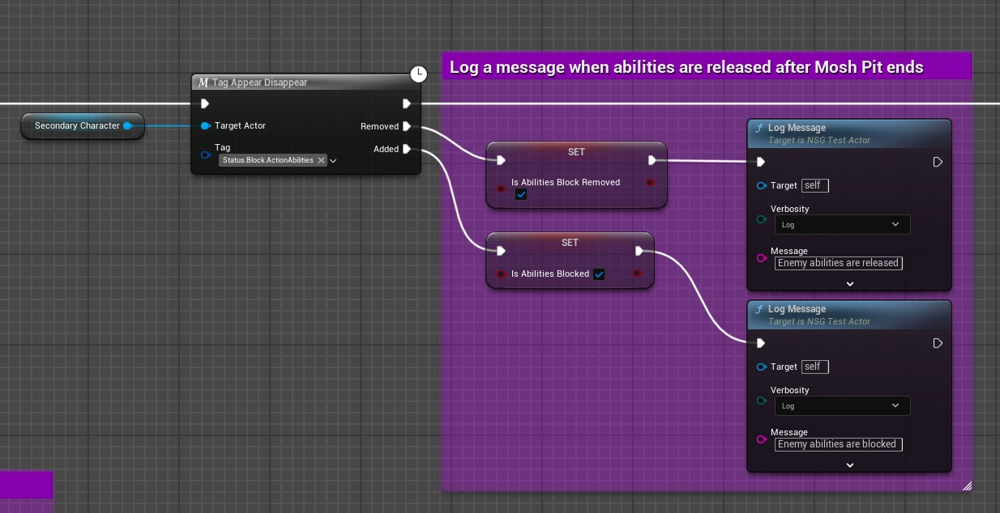

Checks whether enemy abilities become available again after Mosh Pit ends.

### Checks:
- Ability block removal
- Ability release state
- Gameplay tag removal

---

# 9. Weapon Release Validation

  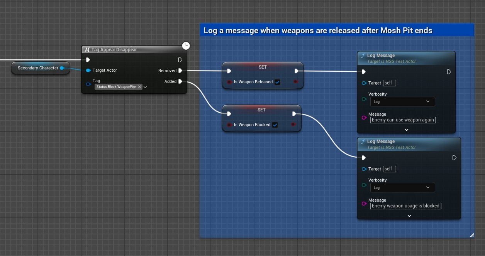

Validates that enemy weapon usage becomes available again after Mosh Pit ends.

### Checks:
- Weapon block removal
- Weapon release validation
- Correct gameplay state restoration

---

# 10. Final Test Validation

  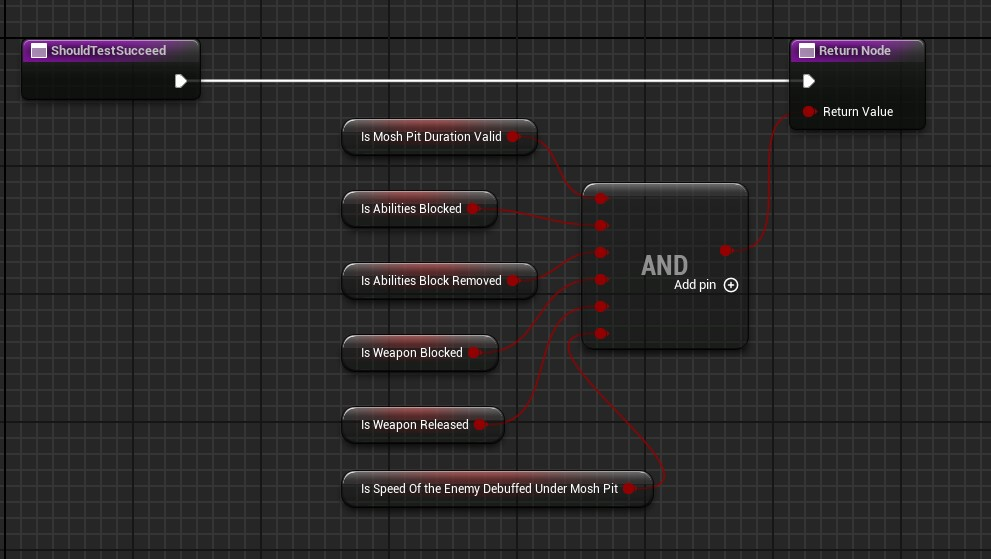

Final AND validation node combining all gameplay validation states.

### The test succeeds only if:
- Mosh Pit duration is valid
- Enemy abilities were blocked correctly
- Enemy abilities were restored correctly
- Weapon usage was blocked correctly
- Weapon usage was restored correctly
- Enemy speed debuff was applied correctly

---

# Skills Demonstrated

- Unreal Engine 5
- Gameplay automation testing
- Blueprint scripting
- Gameplay Ability System (GAS)
- Gameplay Tags
- Runtime gameplay validation
- Event-driven gameplay testing
- Actor lifecycle management

---

# Technologies Used

- Unreal Engine 5
- Blueprint Automation Testing
- Gameplay Ability System (GAS)
- Gameplay Tags
- Blueprint Async Tasks
- Event-driven gameplay validation

---

# Test Result

✅ Test passes only if all gameplay validation checks succeed.

---

# Author

Bogdan Yushkov  
QA Automation Engineer / Unreal Engine 5
